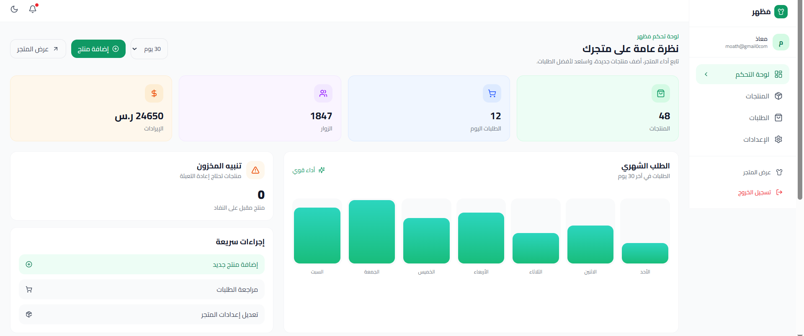
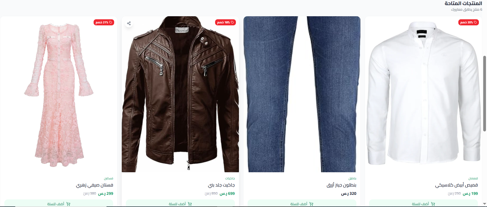
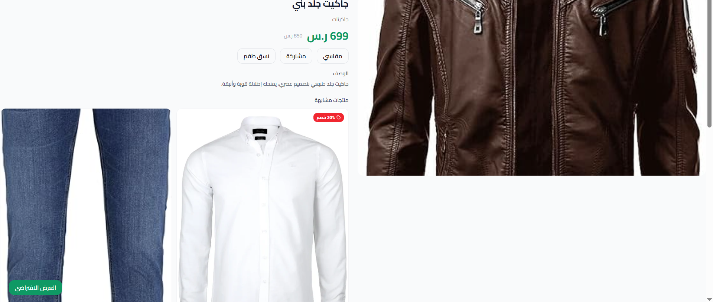
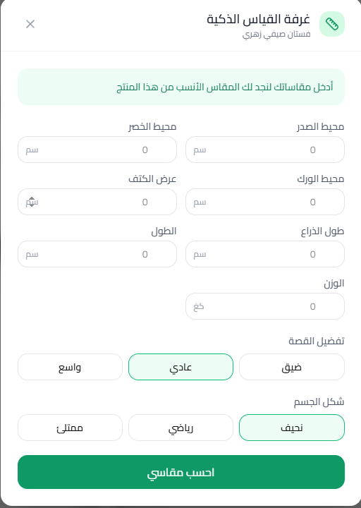
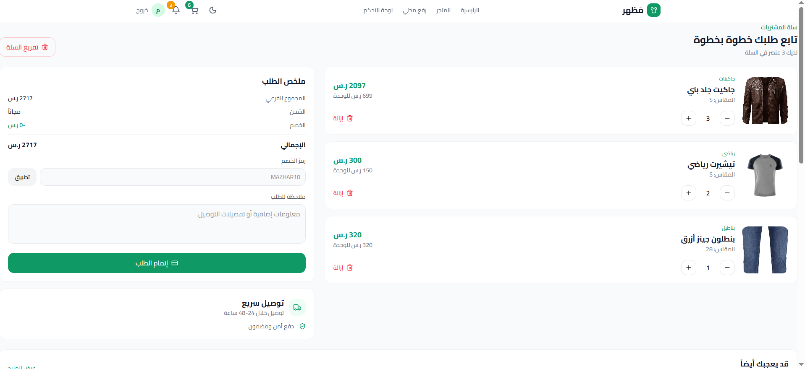

<div align="center">

<br />

# 🛍️ Mazhar — مَظهر

### An AI-powered SaaS platform for building smart fashion stores

<br />

[](https://react.dev/)
[](https://vitejs.dev/)
[](https://tailwindcss.com/)
[](https://reactrouter.com/)
[](./LICENSE)

<br />

> **Mazhar** is a full-featured SaaS platform that empowers fashion retailers and clothing brands to launch their own branded online stores in minutes — complete with AI-powered shopping tools that reduce returns and delight customers.

<br />


</div>

---

## 📑 Table of Contents

- [✨ Overview](#-overview)
- [🚀 Core Features](#-core-features)
- [🧠 Smart AI Features](#-smart-ai-features)
- [📸 Screenshots](#-screenshots)
- [🗂️ Project Structure](#️-project-structure)
- [🛣️ Pages & Routes](#️-pages--routes)
- [🔐 Authentication System](#-authentication-system)
- [🛒 Shopping Cart](#-shopping-cart)
- [🎨 Design System](#-design-system)
- [🔒 Security](#-security)
- [🔍 SEO Optimizations](#-seo-optimizations)
- [⚙️ Requirements & Installation](#️-requirements--installation)
- [🔧 Tech Stack](#-tech-stack)
- [📦 Commit History](#-commit-history)
- [🗺️ Roadmap](#️-roadmap)
- [🤝 Contributing](#-contributing)
- [📄 License](#-license)
- [📞 Contact](#-contact)

---

## ✨ Overview

**Mazhar** (مَظهر — Arabic for "appearance/look") is a modern SaaS e-commerce platform built specifically for the fashion and clothing industry. It allows any seller, designer, or brand to spin up a fully featured online store with zero technical knowledge required.

What makes Mazhar unique is its suite of **intelligent shopping tools** — a Smart Size Guide, Virtual Model, Outfit Matcher, and Friends Vote system — all designed to solve the #1 problem in online fashion: buying the wrong size.

### The Problem We Solve
- **30%** of online clothing purchases are returned due to size mismatch.
- Small shop owners struggle with managing orders via WhatsApp.
- No Arabic platform offers a smart clothing shopping experience.

### Who Is It For?

| Audience | Use Case |
|----------|----------|
| 👗 **Fashion Store Owners** | Launch a branded store, manage products & track orders |
| 🎨 **Clothing Designers** | Showcase collections with interactive try-on tools |
| 🛍️ **Shoppers** | Find perfect sizes and try clothes virtually before buying |

---

## 🚀 Core Features

### 🏪 Store Management
- **Instant store creation** — Every store gets a unique URL at `/shop/:slug`
- **Full customization** — Logo, banner, name, bio, and contact info
- **Comprehensive dashboard** — Sales analytics, order tracking, and inventory in one place
- **Product management** — Add, edit, and delete products with size tables and images
- **Order tracking** — Full lifecycle: `pending → processing → shipped → delivered`
- **Settings persistence** — All store preferences saved to `localStorage`

### 🛒 Shopping Experience
- **Dynamic filtering** — Real-time search by name or category
- **Shopping cart** — Add/remove products with quantity controls and total calculation
- **Product detail page** — Full product view with smart tools, size guide, and pricing
- **Notifications center** — Real-time alerts for store events and updates
- **Social voting** — Share products with friends and collect opinions before buying

### 📊 Admin Dashboard
- **Live stats cards** — Product count, daily orders, visitors, and revenue
- **Bar chart** — Weekly/monthly order trends with a custom-built chart
- **Low stock alerts** — Instant warning when inventory drops below threshold
- **Recent orders panel** — Latest orders with customer name, total, and status
- **Top products list** — Best-performing products ranked by engagement
- **Quick actions** — One-click shortcuts to add products, review orders, or view store

---

## 🧠 Smart AI Features

This is what truly differentiates Mazhar from every other e-commerce platform:

### 📏 Smart Size Guide — `SmartSizeGuide`

An advanced recommendation engine that analyzes the user's actual body measurements and suggests the perfect size for any product.

**How it works:**

```
Input: body measurements (chest, waist, hip, shoulder, arm, height, weight)
       + fit preference (tight / regular / loose)
       + body shape (slim / athletic / full)
            ↓
Matching Algorithm:
  1. Find the size where chestFrom ≤ user.chest ≤ chestTo
  2. Apply preference offset (+1 size for loose, -1 for tight)
            ↓
Output: Recommended size + full comparison table + stock availability
```

**UI Highlights:**
- Two-step modal: measurements form → instant result
- Visual size comparison with "too small" / "too big" indicators per size
- Displays real-time stock count for each size
- One-click to auto-select the recommended size

### 👗 Outfit Matcher — `OutfitMatcher`

Suggests complete, coordinated outfits based on the selected product, user style preferences, and budget.

### 🧍 Virtual Model — `VirtualModel`

Renders a visual preview of how the product will look on a body matching the user's shape and skin tone — bringing the fitting room online.

### 👍 Friends Vote — `ShareVote`

Before committing to a purchase, users can share the product via a dedicated vote link (`/vote/:productId`). Friends vote thumbs up or down, helping the shopper make a confident decision.

---

## 📸 Screenshots

<div align="center">

| Landing Page | Dashboard | Store Front |
|:---:|:---:|:---:|
|  |  |  |

| Product Page | Smart Size Guide | Cart |
|:---:|:---:|:---:|
|  |  |  |

</div>

> 💡 **Note:** Replace the placeholder images with actual screenshots of your running app.

---

## 🗂️ Project Structure

```
mazhar-ecommerce/
├── 📄 index.html                     # App entry point
├── 📦 package.json                   # Dependencies & scripts
├── ⚙️  vite.config.js                # Vite build configuration
├── 🎨 postcss.config.mjs             # PostCSS configuration
│
└── src/
    ├── 🚀 main.jsx                   # React bootstrap + router mount
    │
    ├── styles/
    │   ├── index.css                 # Global base styles
    │   ├── theme.css                 # CSS custom properties (colors, spacing)
    │   ├── tailwind.css              # Tailwind directives
    │   └── fonts.css                 # Cairo font import
    │
    └── app/
        ├── 📱 App.jsx                # Root component with context providers
        ├── 🛣️  routes.jsx             # Centralized route definitions
        │
        ├── contexts/                 # Global state management
        │   ├── AuthContext.jsx       # Auth: login, register, logout, updateProfile
        │   ├── CartContext.jsx       # Cart: items, quantities, totals
        │   └── ThemeContext.jsx      # Dark / light mode toggle
        │
        ├── pages/                    # Full page components
        │   ├── LandingPage.jsx       # Hero, features, how it works, reviews, CTA
        │   ├── LoginPage.jsx         # Email + password login form
        │   ├── RegisterPage.jsx      # New account creation
        │   ├── ShopPage.jsx          # Public store with search & category filter
        │   ├── ProductsPage.jsx      # Dashboard product list table
        │   ├── ProductPage.jsx       # Product detail + smart tools
        │   ├── AddProductPage.jsx    # Add / edit product form
        │   ├── CartPage.jsx          # Cart items + order summary
        │   ├── DashboardPage.jsx     # Main admin overview
        │   ├── OrdersPage.jsx        # Order management & status updates
        │   ├── SettingsPage.jsx      # Profile, store, preferences, images
        │   ├── NotificationsPage.jsx # Notification center with filters
        │   ├── LocalPage.jsx         # Local stores directory
        │   ├── VotePage.jsx          # Friends social voting page
        │   └── NotFoundPage.jsx      # 404 error page
        │
        ├── components/
        │   ├── shared/               # Reusable layout & UI components
        │   │   ├── Navbar.jsx                    # Top navigation bar
        │   │   ├── Footer.jsx                    # Site footer
        │   │   ├── RootLayout.jsx                # Public layout wrapper
        │   │   ├── DashboardLayout.jsx           # Sidebar + content layout
        │   │   ├── ProductCard.jsx               # Product grid card
        │   │   ├── StatCard.jsx                  # Dashboard stat widget
        │   │   ├── ConfirmDialog.jsx             # Action confirmation modal
        │   │   ├── EmptyState.jsx                # Empty list placeholder
        │   │   ├── LoadingSpinner.jsx            # Loading indicator
        │   │   └── ProtectedDashboardRoute.jsx  # Auth guard for /dashboard
        │   │
        │   └── smart/                # AI-powered interactive tools
        │       ├── SmartSizeGuide.jsx  # Body measurement → size recommendation
        │       ├── OutfitMatcher.jsx   # Outfit suggestion engine
        │       ├── VirtualModel.jsx    # Virtual try-on preview
        │       └── ShareVote.jsx       # Social vote sharing UI
        │
        └── data/
            ├── mockData.js             # Products, orders, stats mock data
            └── (lib/mockNotifications) # Notification mock data
```

---

## 🛣️ Pages & Routes

### Public Routes

| Path | Page | Description |
|------|------|-------------|
| `/` | `LandingPage` | Hero section, features, how-it-works, testimonials, CTA |
| `/login` | `LoginPage` | Sign in with email and password |
| `/register` | `RegisterPage` | Create a new merchant account |
| `/shop/:slug` | `ShopPage` | Customer-facing storefront with filtering |
| `/shop/:slug/product/:id` | `ProductPage` | Product detail with Smart Tools |
| `/cart` | `CartPage` | Shopping cart and checkout summary |
| `/notifications` | `NotificationsPage` | Store notification center |
| `/local` | `LocalPage` | Local stores discovery directory |
| `/vote/:productId` | `VotePage` | Friends voting on a specific product |
| `/*` | `NotFoundPage` | Custom 404 error page |

### Protected Dashboard Routes

> 🔒 All routes below require an authenticated session — enforced by `ProtectedDashboardRoute`

| Path | Page | Description |
|------|------|-------------|
| `/dashboard` | `DashboardPage` | Overview: stats, chart, recent orders, top products |
| `/dashboard/products` | `ProductsPage` | Full product inventory management |
| `/dashboard/products/new` | `AddProductPage` | Add a new product with sizes & images |
| `/dashboard/products/:id/edit` | `AddProductPage` | Edit an existing product |
| `/dashboard/orders` | `OrdersPage` | Order list with status management |
| `/dashboard/settings` | `SettingsPage` | Profile, store branding, and preferences |

---

## 🔐 Authentication System

Built with React Context API and `localStorage` persistence — no backend required to run the demo.

| Feature | Details |
|---------|---------|
| **Register** | Creates an account with name, email, and password |
| **Login** | Authenticates by matching stored user email |
| **Update Profile** | Updates name, email, store slug, phone, bio, avatar, logo, and banner |
| **Logout** | Clears the current session from `localStorage` |
| **Route Protection** | `ProtectedDashboardRoute` redirects unauthenticated users to `/login` |
| **Data Sync** | Profile changes instantly reflect across the store and dashboard |
| **Persistence** | Session survives page refresh via `localStorage` |

```jsx
// Usage example
const { user, login, register, logout, updateProfile, loading } = useAuth()

// Register a new merchant
await register('Sarah Johnson', 'sarah@store.com', 'password123')

// Update store branding
await updateProfile({ storeSlug: 'sarahs-boutique', logo: logoUrl })
```

---

## 🛒 Shopping Cart

Cart state is managed globally via `CartContext` — available on every page.

### Supported Operations

```
addToCart(product, size, quantity)    → Add item to cart
removeFromCart(productId)             → Remove item entirely
updateQuantity(productId, newQty)     → Change item quantity
clearCart()                           → Empty the entire cart
cartTotal                             → Auto-computed via useMemo
cartCount                             → Badge counter for Navbar
```

---

## 🎨 Design System

### Color Palette

| Token | Value | Usage |
|-------|-------|-------|
| **Primary — Emerald** | `#059669` | Buttons, links, highlights, badges |
| **Secondary — Teal** | `#0d9488` | Gradients, hover states |
| **Dark BG** | `#030712` (gray-950) | Dark mode background |
| **Card BG** | `#111827` (gray-900) | Dark mode card surfaces |
| **Light BG** | `#f9fafb` (gray-50) | Light mode background |

### Typography

```css
font-family: 'Cairo', sans-serif;
/* Google Font — supports both Arabic RTL and Latin LTR */
```

### Design Patterns

| Pattern | Where Used |
|---------|-----------|
| **Glassmorphism** | Shop header, dashboard stats, floating badges |
| **Smooth Gradients** | `emerald → teal → cyan` across hero sections |
| **Large Border Radius** | `rounded-2xl` / `rounded-3xl` for a modern soft feel |
| **Backdrop Blur** | Store hero card, navbar overlays |
| **Dark Mode** | Full system-wide dark/light toggle via `ThemeContext` |
| **Responsive Grid** | 1 → 2 → 4 column layouts adapting to screen size |
| **Hover Micro-animations** | `-translate-y-1` and `scale-105` on interactive cards |

---

## 🔒 Security

While the current demo uses `localStorage` for simplicity, security best practices are already embedded in the architecture.

| Layer | Current Implementation | Future (with Backend) |
|-------|------------------------|------------------------|
| **Authentication** | React Context + localStorage | Supabase Auth / JWT |
| **Route Protection** | `ProtectedDashboardRoute` component | Same + server-side verification |
| **Input Validation** | Client-side form validation | Server-side validation via API |
| **HTTPS** | Enforced in production | Enforced end-to-end |
| **Data Isolation** | Each store data is isolated in state | Row Level Security (RLS) on database |
| **Secrets** | No API keys exposed | Environment variables for sensitive keys |

> ⚠️ **Important:** The current version is a **frontend demo**. A production version will include a secure backend with proper encryption, server-side auth, and database policies.

---

## 🔍 SEO Optimizations

The platform is built with search engines and social sharing in mind:

| Optimization | Implementation |
|--------------|----------------|
| **Dynamic Title & Meta** | Each page sets its own `<title>` and `<meta>` tags |
| **Open Graph Tags** | Rich previews when sharing on Facebook, WhatsApp, etc. |
| **Twitter Cards** | Optimized previews for Twitter/X sharing |
| **Semantic HTML** | Proper use of `<h1>`, `<h2>`, `<nav>`, `<main>`, `<article>` |
| **Image Alt Text** | Every product image includes descriptive `alt` text |
| **Canonical URLs** | Unique, clean URLs for each product and store |
| **Responsive Design** | Mobile-first, works flawlessly on all devices |
| **Fast Loading** | Vite code splitting, lazy loading, optimized assets |
| **PWA Ready** | The app can be installed on mobile devices |

---

## ⚙️ Requirements & Installation

### Prerequisites

- **Node.js** >= 18.0.0
- **npm**, **pnpm**, or **yarn**

### Getting Started

```bash
# 1. Clone the repository
git clone https://github.com/ProMoath/ecommerce-saas-demo.git
cd mazhar-ecommerce

# 2. Install dependencies
npm install
# or with pnpm (recommended)
pnpm install

# 3. Start the development server
npm run dev

# 4. Open your browser at
# http://localhost:5173
```

### Production Build

```bash
# Build optimized production bundle
npm run build

# Output files will be in the /dist directory
```

### Environment Variables

No environment variables are required to run the project. All data is currently mocked locally. When connecting a backend, create a `.env` file:

```env
VITE_API_URL=https://your-api.com
VITE_SUPABASE_URL=https://xyz.supabase.co
VITE_SUPABASE_ANON_KEY=your-anon-key
```

---

## 🔧 Tech Stack

### Frontend Core

| Technology | Version | Purpose |
|------------|---------|---------|
| **React** | 18.3.1 | UI component framework |
| **React Router** | 7.17.0 | Client-side routing (SPA) |
| **Vite** | 6.3.5 | Build tool & dev server |
| **Tailwind CSS** | 4.1.12 | Utility-first styling |
| **Lucide React** | 0.487.0 | Icon library |

### UI Component Libraries

| Library | Version | Purpose |
|---------|---------|---------|
| **Radix UI** | various | Accessible, unstyled UI primitives |
| **MUI (Material UI)** | 7.3.5 | Additional UI components |
| **shadcn/ui** | — | Pre-built styled components |
| **Recharts** | 2.15.2 | Dashboard charts & graphs |
| **Motion** | 12.23.24 | Smooth animations |
| **Sonner** | 2.0.3 | Toast notifications |
| **Embla Carousel** | 8.6.0 | Product image carousel |
| **Vaul** | 1.1.2 | Mobile-friendly drawer |

### Utilities & Helpers

| Package | Purpose |
|---------|---------|
| **React Hook Form** | Form state management & validation |
| **date-fns** | Date formatting and manipulation |
| **clsx + tailwind-merge** | Conditional class name merging |
| **canvas-confetti** | Celebratory confetti animations |
| **react-dnd** | Drag-and-drop interactions |
| **class-variance-authority** | Component variant management |
| **cmdk** | Command palette component |
| **next-themes** | Theme persistence & switching |
| **input-otp** | OTP input component |

### Deployment & Future Backend

| Technology | Purpose |
|------------|---------|
| **Vercel** | Frontend hosting (recommended) |
| **Supabase** | Planned backend (Auth, Database, Storage) |

---

## 🗺️ Roadmap

### Phase 1 — Current ✅

- [x] Full authentication system (register, login, logout, profile update)
- [x] Public storefront with dynamic search and category filtering
- [x] Admin dashboard with analytics, product management, and order tracking
- [x] Shopping cart with quantity management
- [x] Smart Size Guide with body measurement algorithm
- [x] Outfit Matcher and Virtual Model components
- [x] Friends Social Voting system
- [x] Full dark mode support
- [x] Fully responsive layout (mobile → desktop)

### Phase 2 — Coming Soon 🔜

- [ ] **Backend & Database** — Supabase or Firebase integration
- [ ] **Image Uploads** — Cloudinary or AWS S3 for product and store images
- [ ] **Payment Gateway** — Stripe / PayTabs / HyperPay integration
- [ ] **WhatsApp Notifications** — Order confirmations via WhatsApp Business API
- [ ] **Advanced Analytics** — Detailed sales reports and conversion tracking
- [ ] **Multi-language** — Full Arabic + English i18n support
- [ ] **Mobile App** — React Native companion app

### Phase 3 — Future Vision 🌟

- [ ] **AI Recommendations** — Personalized product suggestions per shopper
- [ ] **Subscription Plans** — Free / Pro / Enterprise tiers
- [ ] **Multi-vendor** — Support for marketplace with multiple sellers
- [ ] **Inventory Sync** — Real-time stock management across channels

---

## 🤝 Contributing

Contributions are welcome! To get started:

```bash
# 1. Fork the repository on GitHub

# 2. Create a feature branch
git checkout -b feature/your-feature-name

# 3. Make your changes and commit
git commit -m "feat: describe your change"

# 4. Push your branch
git push origin feature/your-feature-name

# 5. Open a Pull Request on GitHub
```

### Commit Convention

Please follow [Conventional Commits](https://www.conventionalcommits.org/):

| Prefix | Usage |
|--------|-------|
| `feat` | A new feature |
| `fix` | A bug fix |
| `docs` | Documentation changes |
| `style` | Code formatting (no logic change) |
| `refactor` | Code refactor without feature change |
| `chore` | Build process or tooling changes |

---

## 📄 License

This project is licensed under the [MIT License](./LICENSE) — feel free to use, fork, and build on it.

```
MIT License

Copyright (c) 2026 Moath Alshahari

Permission is hereby granted, free of charge, to any person obtaining a copy
of this software and associated documentation files (the "Software"), to deal
in the Software without restriction, including without limitation the rights
to use, copy, modify, merge, publish, distribute, sublicense, and/or sell
copies of the Software, and to permit persons to whom the Software is
furnished to do so, subject to the following conditions...
```

---

## 📞 Contact

| Channel | Details |
|---------|---------|
| 👨‍💻 **Developer** | Moath Alshahari |
| 📧 **Email** | [moathalshah2023@gmail.com](mailto:moathalshah2023@gmail.com) |
| 🐙 **GitHub** | [@ProMoath](https://github.com/ProMoath) |
| 💬 **WhatsApp** | [Message me](https://wa.me/967776186698) |

---

<div align="center">

<br />

### ⭐ Support the Project

If you find this project useful, please give it a star on GitHub and share it with others!

[](https://github.com/ProMoath/ecommerce-saas-demo)

Built with ❤️ and a lot of ☕

**[⬆ Back to Top](#️-mazhar--مَظهر)**

</div>